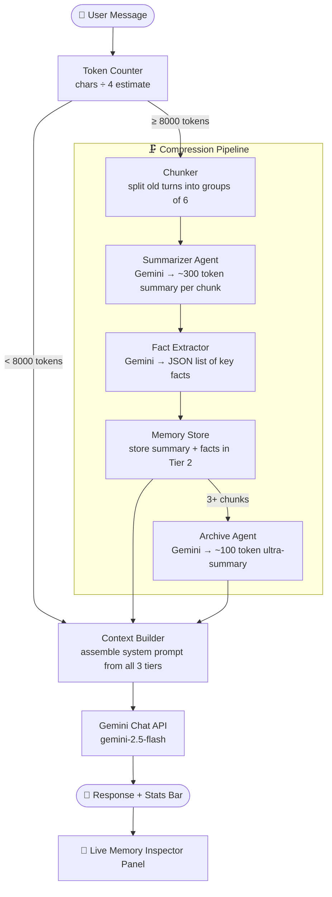
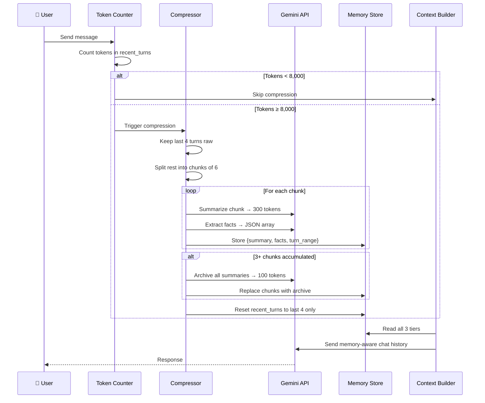
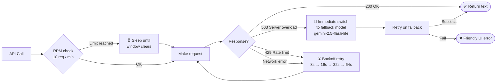

<div align="center">

# 🗜️ Context Window Compressor

### *"A ZIP file for LLM memory."*

**Give any LLM infinite memory — by teaching it to compress its own history.**


</div>

---

## 📌 The Problem

Every LLM has a **fixed context window** — a maximum amount of text it can hold in memory at once.

Think of it like a whiteboard:

```
┌────────────────────────────── WHITEBOARD (Context Window) ──────────────────────────────┐
│                                                                                           │
│  msg 1: "My name is Muhammad..."    msg 2: "I study at FAST..."    msg 3: "My project..." │
│  msg 4: "...budget is 50000 PKR"     msg 5: "Tell me about..."      msg 6: "Can you..."   │
│                                                                                           │
│  ← ERASED when full ──────────────────────────────────────── ALWAYS KEPT → msg 40–44 →  │
└───────────────────────────────────────────────────────────────────────────────────────────┘
```

When the whiteboard is full — **the oldest writing gets erased forever**. The AI literally cannot remember it.

**This affects every AI product in the world:**
- 🤖 Customer support bots forget the start of long calls
- 💻 Coding assistants forget earlier code in the same session  
- 📚 AI tutors forget what they already taught you

---

## 💡 The Solution

Instead of deleting old messages, this system **compresses them first** — like zipping a file.

```
❌  Normal approach:   delete old messages  →  information lost forever
✅  This system:       summarize → extract facts → store compressed  →  nothing important lost
```

> *"ChatGPT memory remembers your name. Our system remembers your entire conversation — and shows you exactly what it kept and why."*

---

## 🏗️ Architecture



---

## 🧠 The 3-Tier Memory System

```
╔══════════════════════════════════════════════════════════════════╗
║                    HIERARCHICAL MEMORY STORE                     ║
╠══════════╦═══════════════════════════════╦════════════════════════╣
║  TIER    ║  CONTENTS                     ║  SIZE                  ║
╠══════════╬═══════════════════════════════╬════════════════════════╣
║  📁 1    ║  Recent turns (raw)           ║  Full size             ║
║  RECENT  ║  Last 4 messages, untouched   ║  Used most by model    ║
╠══════════╬═══════════════════════════════╬════════════════════════╣
║  📦 2    ║  Compressed chunks            ║  ~300 tokens each      ║
║  CHUNKS  ║  Gemini summaries of old msgs ║  + JSON facts list     ║
╠══════════╬═══════════════════════════════╬════════════════════════╣
║  🗄️  3   ║  Archive summary              ║  ~100 tokens total     ║
║  ARCHIVE ║  Summary of all summaries     ║  Oldest history        ║
╚══════════╩═══════════════════════════════╩════════════════════════╝

                  AGE →  older = more compressed  →
```

The older a message is, the more compressed it gets — but **key facts always survive**.

---

## 🔄 Compression Flow (Step by Step)



---

## 🛡️ Rate Limiter & Fallback



| Model | RPM | RPD | Role |
|-------|-----|-----|------|
| `gemini-2.5-flash` | 10 | 250 | Primary — always tried first |
| `gemini-2.5-flash-lite` | 15 | 1,000 | Fallback — auto-switches on 503 |

---

## 📊 Understanding the Stats Bar

Every reply shows this at the bottom:

```
📊 Recent tokens: 13600 | Compressed chunks: 2 | Archive: ❌ | Compression fired: 🗜️ YES
```

| Field | Meaning |
|-------|---------|
| **Recent tokens** | Estimated tokens of raw turns still in full memory |
| **Compressed chunks** | How many old turn-groups have been summarized |
| **Archive** | ✅ = 3+ chunks collapsed into one ultra-dense blob; ❌ = not yet |
| **Compression fired** | 🗜️ YES = pipeline ran this turn and freed up space |

### How it progresses over a long conversation

```
Turns  1–20  │ tokens:  2,400 │ chunks: 0 │ ❌  no compression yet
Turns 21–40  │ tokens:  4,800 │ chunks: 0 │ ❌
Turns 41–60  │ tokens:  8,100 │ chunks: 1 │ ❌  ← first compression fires 🗜️
Turns 61–80  │ tokens:  4,200 │ chunks: 2 │ ❌  ← tokens reset after compression
Turns 81–100 │ tokens:  8,300 │ chunks: 3 │ ✅  ← archive triggered
```

---

## 🖥️ UI Layout

```
┌─────────────────────────────────────────────────────────────────────────┐
│  🗜️ Context Window Compressor                                            │
├──────────────────────────────────────┬──────────────────────────────────┤
│                                      │  🧠 Live Memory Inspector         │
│   💬 Chat                            │ ─────────────────────────────── │
│  ┌────────────────────────────────┐  │  🗄️  ARCHIVE                      │
│  │                                │  │  (empty — triggers at 3+ chunks) │
│  │   [conversation messages]      │  │                                   │
│  │                                │  │  📦 COMPRESSED CHUNKS (2 stored)  │
│  │                                │  │  [ Chunk 1 │ Turns 1-6 ]         │
│  │                                │  │  Summary: User is Muhammad...     │
│  │  📊 tokens: 13600 | chunks: 2  │  │  Facts: Name │ University │ ...  │
│  └────────────────────────────────┘  │                                   │
│  ┌─────────────────────────────────┐ │  💬 RECENT TURNS (4 raw)         │
│  │ Type your message...            │ │  USER: Compare GPT models...      │
│  └─────────────────────────────────┘ │  ASSISTANT: GPT-2 was...          │
│  [ Send ]  [ 🔄 Reset Memory ]       │  [ 🔄 Refresh Memory View ]       │
└──────────────────────────────────────┴──────────────────────────────────┘
```

---

## ✅ The Memory Test (Proven Working)

1. Start a chat: *"My name is Muhammad and I study at FAST Peshawar."*
2. Have a long conversation on other topics until compression fires (`🗜️ YES`)
3. Ask: *"What is my name and what university do I go to?"*

**Expected result:** The system answers correctly from compressed memory — the original message is gone from `recent_turns` but its facts were extracted and stored in `compressed_chunks[0]["facts"]`, then injected into every subsequent system prompt.

**Result confirmed ✅** — Facts survive multiple rounds of compression.

---

## 🚀 Quick Start

```bash
# 1. Clone the repo
git clone https://github.com/BoltTaha/Context-Window-Compressor.git
cd Context-Window-Compressor

# 2. Create and activate virtual environment
python3 -m venv venv
source venv/bin/activate        # Linux / macOS
# venv\Scripts\activate         # Windows

# 3. Install dependencies
pip install -r requirements.txt

# 4. Add your Gemini API key
echo "GEMINI_API_KEY=your_key_here" > .env

# 5. Run
python app.py
```

Open **[http://127.0.0.1:7860](http://127.0.0.1:7860)** in your browser.

> Get a free Gemini API key at [aistudio.google.com](https://aistudio.google.com) — no credit card required.

---

## ⚙️ Configuration

All settings are in `config.py`:

| Parameter | Default | Description |
|-----------|---------|-------------|
| `MAX_CONTEXT_TOKENS` | `8000` | Compression triggers when recent turns exceed this |
| `RECENT_TURNS_TO_KEEP` | `4` | Last N turns always kept as raw full-fidelity |
| `CHUNK_SIZE_TURNS` | `6` | Turns grouped per compressed chunk |
| `LEVEL_1_SUMMARY_TOKENS` | `300` | Token target per chunk summary |
| `LEVEL_2_SUMMARY_TOKENS` | `100` | Token target for the archive |
| `GEMINI_MODEL` | `gemini-2.5-flash` | Primary model |
| `GEMINI_FALLBACK_MODEL` | `gemini-2.5-flash-lite` | Auto-fallback on 503 |

---

## 📁 File Structure

```
context-window-compressor/
│
├── app.py               # Gradio UI — 2-column layout, chat loop, error handling
├── compressor.py        # Core compression pipeline (chunk → summarize → archive)
├── memory_store.py      # 3-tier memory data structure
├── context_builder.py   # Assembles system prompt from all memory tiers
├── fact_extractor.py    # Gemini-powered JSON fact extraction
├── token_utils.py       # Token estimation (chars ÷ 4)
├── rate_limiter.py      # Sliding-window RPM guard + retry + fallback
├── config.py            # All tuneable constants
│
├── requirements.txt     # Pinned dependencies
├── .env                 # ← YOUR API KEY (never committed)
└── .gitignore
```

---

## 📦 Dependencies

| Package | Version | Role |
|---------|---------|------|
| `google-genai` | 1.73.0 | Gemini API client (new SDK) |
| `gradio` | 6.12.0 | Web UI framework |
| `python-dotenv` | 1.2.2 | Loads `.env` file |
| `tenacity` | 9.1.4 | Retry utilities |
| `httpx` | 0.28.1 | HTTP client |
| `pydantic` | 2.13.0 | Data validation |
| `fastapi` | 0.135.3 | Gradio's web server backend |
| `uvicorn` | 0.44.0 | ASGI server |

---

## ❓ Why Not Just Use ChatGPT Memory?

| | ChatGPT / Gemini Memory | This System |
|--|------------------------|-------------|
| **Works in your own app** | ❌ Locked to their product | ✅ Plug into any API |
| **Transparent** | ❌ Black box — you can't see what it kept | ✅ Full visibility into every tier |
| **Scope** | Cross-session user profile | Single-session context management |
| **Model support** | One product only | Any LLM (Gemini, GPT, Claude, LLaMA) |
| **Free tier friendly** | N/A | ✅ Works within 10 RPM free tier |

---

---

## 🚧 Current Version — v1.0 (What's Built)

This is the **base version** — a fully working proof of concept that demonstrates hierarchical context compression end-to-end.

```
✅  3-tier memory system (recent → compressed → archive)
✅  Gemini-powered summarization + fact extraction
✅  Live memory inspector panel in UI
✅  Rate limiter with sliding-window RPM guard
✅  Auto-fallback from gemini-2.5-flash → gemini-2.5-flash-lite on 503
✅  Exponential backoff retry on 429 / network errors
✅  Friendly error messages in UI (no crashes)
✅  Full stats bar on every reply
✅  Terminal JSON memory dump on every compression event
```

---

## 🔭 Future Roadmap — What This Can Grow Into

This base version proves the concept. Here's where it can expand:

### 🔌 v2.0 — Model-Agnostic Middleware
> Plug this pipeline in front of **any LLM**, not just Gemini

```
Current:   App → Gemini only
Future:    App → Compressor Middleware → GPT-4 / Claude / LLaMA / any model
```

- Wrap as a Python package: `pip install context-compressor`
- Standard interface: `compress.chat(messages, model="gpt-4o")`
- Drop-in replacement for any `openai.chat.completions.create()` call

---

### 💾 v2.1 — Persistent Memory (Cross-Session)
> Right now memory resets when you close the app. Future version saves it.

```
Current:   Memory lives in RAM → lost on restart
Future:    Memory saved to SQLite / Redis → survives restarts
```

- Save `MemoryStore` to disk after each turn
- Load it back on startup
- Users can pick up conversations days later

---

### 📊 v2.2 — Memory Analytics Dashboard
> Visualize exactly how much compression is saving

```
┌─────────────────────────────────────────┐
│  Tokens without compression:   48,000   │
│  Tokens with compression:       6,200   │
│  Compression ratio:              7.7×   │
│  Facts preserved:                  34   │
│  API calls saved:                  ~60  │
└─────────────────────────────────────────┘
```

- Live chart showing token usage over time
- Compression ratio tracker
- Facts preserved counter

---

### 🔑 v2.3 — Smart Fact Weighting
> Not all facts are equally important — weight them by relevance

```
Current:   All facts treated equally
Future:    Facts scored by recency + frequency + importance
           "Name" score: 10/10 (mentioned 8 times)
           "Budget" score: 7/10 (mentioned 3 times, recent)
           "Casual remark" score: 2/10 (mentioned once, old)
```

- Prioritize facts that appear more often
- Boost facts mentioned in recent turns
- Drop low-score facts when archive is full

---

### 🌐 v2.4 — REST API + SDK
> Let other developers use this as a service

```python
# Future usage — drop into any app
from context_compressor import CompressorClient

client = CompressorClient(api_key="...", model="gemini-2.5-flash")
response = client.chat("What was my name again?")
# → Answers from compressed memory automatically
```

- FastAPI backend exposing `/chat`, `/memory`, `/reset` endpoints
- SDK for Python, JavaScript
- Docker image for self-hosting

---

### 🤖 v3.0 — Multi-Agent Memory Sharing
> Multiple AI agents sharing one compressed memory pool

```
Agent 1 (Research)  ─┐
Agent 2 (Coding)    ─┼──→  Shared MemoryStore  →  Context Builder
Agent 3 (Writing)   ─┘
```

- Agents contribute to and read from the same memory
- Automatic conflict resolution when agents disagree
- Ideal for complex multi-step AI pipelines

---

## 🤝 Contributing

Pull requests are welcome! For major changes, please open an issue first.

```bash
git clone https://github.com/BoltTaha/Context-Window-Compressor.git
cd Context-Window-Compressor
python3 -m venv venv && source venv/bin/activate
pip install -r requirements.txt
```

---

<div align="center">

Built with ❤️ by **[BoltTaha](https://github.com/BoltTaha)** using **Gemini 2.5 Flash** · **Gradio** · **Python 3.12**

⭐ Star this repo if you found it useful!

</div>
